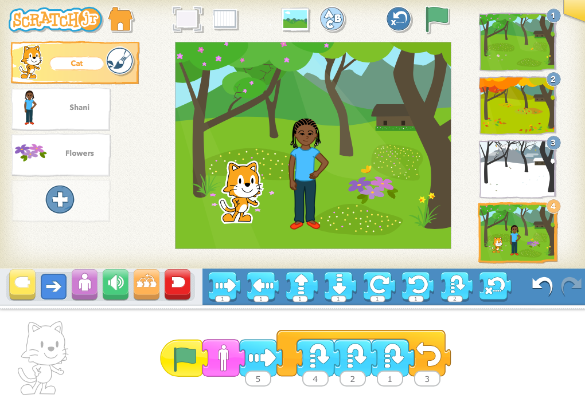
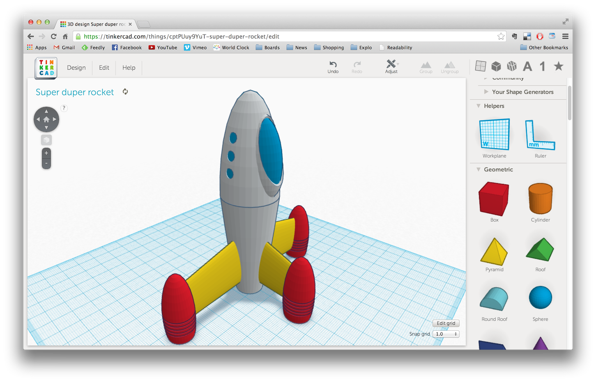

#  Introducción a la robótica y al pensamiento computacional en educación Infantil y Primaria

## [https://bit.ly/RobSteam](https://bit.ly/RobSteam)

Licencia CC by SA @javacasm

## Objetivos
- Facilitar la alfabetización digital para el aprendizaje de competencias.
- Introducción al pensamiento computacional en el entorno de juegos
- Desarrollar estrategias de resolución de problemas
- Aprender a programar mediante bloques
- Usar transversalmente herramientas computacionales
- Usar impresoras 3D
- Hacer diseños 3D sencillos 

## Contenidos
* [El pensamiento computacional y los juegos](./scratch/9.0.PC_Unplugged.md)
* [Robótica en educación](./scratch/8.0.RoboticaIntroduccion.md)
* [Robótica en educación primaria](./scratch/8.1.0.RoboticaPrimaria.md)
* [Programación en la educación](./scratch/1.0.ProgramacionEnEducacion.md)
* [Programando con bloques: Scratch](./scratch/3.0.Scratch3.0.md)
* [Placa Makey-Makey y su uso con Scratch](./scratch/8.2.QueEsMM.md)
* [Robótica con micro:bit](./microbit/0.Introduccion.md)
* [Uso de impresoras 3D](./3D/README.md)
* [Introducción al diseño 3D](./3D/9.0.HerramientasDiseño3D.md)

## Niveles y herramientas

Ed. Infantil: 
* Uso de escornabot con tapetes adecuados
* Uso de proyectos con makey-makey y scratch
* Juegos de pensamiento computacional desconectado
* Uso de piezas impresas en 3D

Ed. Primaria - 1er ciclo
* Uso de escornabot
* Programación con Scratch Jr
* Uso de makey-makey
* Juegos de pensamiento computacional desconectado
* Uso de piezas impresas en 3D

Ed. Primaria - 2º ciclo
* Uso y montaje de makey-makey 
* Programación con Scratch
* Juegos de pensamiento computacional desconectado
* Introducción al diseño 3D

Ed. Primaria - 3er ciclo
* Programación de micro:bit
* Montaje de makey-makey
* Programación de scratch 
* Montaje de Escornabot
* Juegos de pensamiento computacional desconectado
* Diseño 3D con Tinkercad
* Uso de impresoras 3D

## Herramientas

[Pensamiento computacional desconectado](https://csunplugged.org/es/)

[Escornabot](https://escornabot.com/es/index)

[Tapetes para escornabot](https://pablorubma.cc/escornabot/tableros-y-recursos/)

[micro:bit](http://microbit.org/)

[Scratch](https://scratch.mit.edu/)

[Scratch Jr.](https://www.scratchjr.org/)

[Tinkercad](https://tinkercad.com)

### Recursos

[Propuesta con objetivos mínimos para cada nivel educativo de Intef](http://code.intef.es/wp-content/uploads/2018/10/Ponencia-sobre-Pensamiento-Computacional.-Informe-Final.pdf#page=65)
